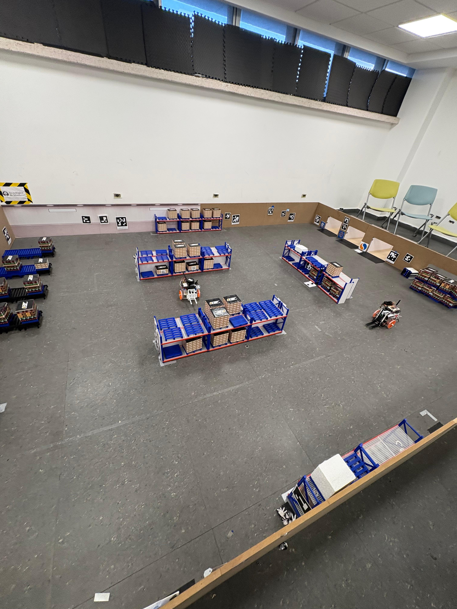
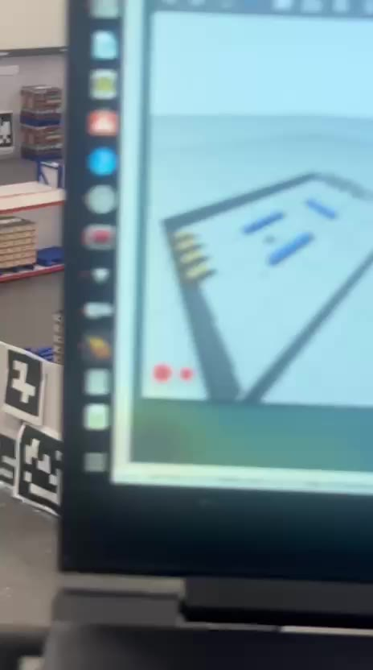
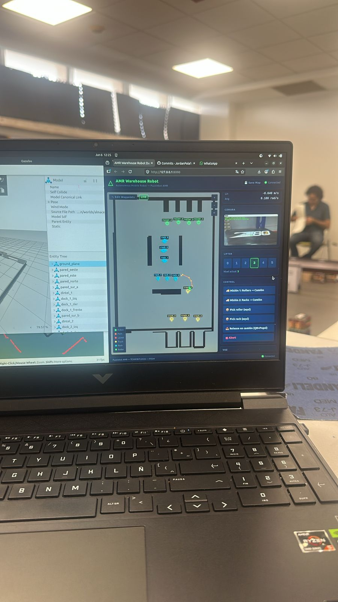
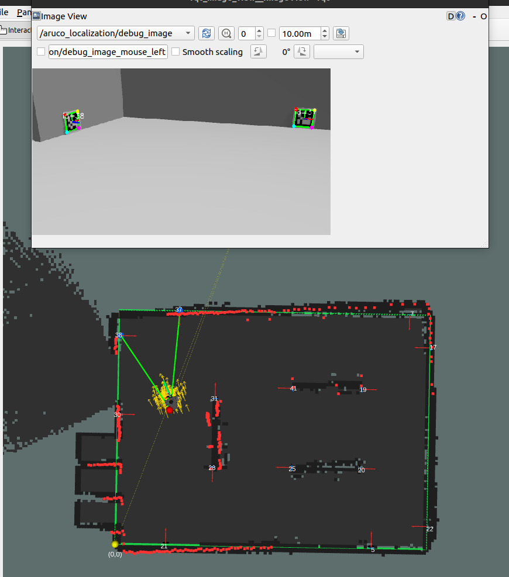

<div align="center">

# 🤖 Puzzlebot AMR — Robot Montacargas Autónomo

**Almacén autónomo a escala: SLAM propio, localización por ArUco, navegación A\*, visión, voz y gemelo digital en vivo.**

Reto **TE3003B** · Integración de Robótica y Sistemas Inteligentes · Tecnológico de Monterrey (FJ2026)


</div>

<div align="center">

[](https://www.youtube.com/shorts/AEM72Lx7E6k)

▶️ **[Ver la Misión 1 en video (YouTube)](https://www.youtube.com/shorts/AEM72Lx7E6k)**

</div>

---

## 📑 Tabla de contenidos
- [Sobre el proyecto](#-sobre-el-proyecto)
- [Demo](#-demo)
- [Características](#-características)
- [Arquitectura del sistema](#-arquitectura-del-sistema)
- [Stack tecnológico](#-stack-tecnológico)
- [Hardware](#-hardware)
- [Estructura del repositorio](#-estructura-del-repositorio)
- [Instalación](#-instalación)
- [Uso](#-uso)
- [Comandos más útiles](#-comandos-más-útiles)
- [Subsistemas a detalle](#-subsistemas-a-detalle)
- [Configuración](#-configuración)
- [Equipo](#-equipo)

---

## 🎯 Sobre el proyecto

El **Puzzlebot AMR** es un robot montacargas autónomo (Autonomous Mobile Robot) que opera en un
**almacén a escala (3.65 × 4.85 m)**. Mueve pallets entre tres tipos de zona:

- 🚚 **Camiones (trucks)** — carga / descarga
- 🗄️ **Racks** — estanterías de 2 niveles
- 🛞 **Rollers** — mesas de rodillos (staging)

Toda la pila (SLAM, localización, navegación, control, percepción, voz) es **implementación propia
— sin Nav2 ni Whisper**. El sistema corre **distribuido**: la Jetson a bordo del robot maneja el
sensado y SLAM en tiempo real, y una laptop corre la planeación, la lógica de misión, el dashboard
y un **gemelo digital** que refleja al robot real en vivo.

> 📷 *Pista real y robot:*
> 

---

## 🎬 Demo

| Misión 1 — robot real ▶️ | Gemelo digital (Gazebo) ▶️ | Dashboard web |
|:--:|:--:|:--:|
| [](https://www.youtube.com/shorts/AEM72Lx7E6k) | [](assets/gemelo.mp4) |  |

> El robot real ejecuta **Misión 1 (Rollers → Camión)**; el **gemelo digital** lo refleja en vivo en Gazebo; el **dashboard** controla y monitorea la misión.

---

## ✨ Características

- 🧭 **SLAM propio en C++** — filtro de partículas (MCL/AMCL) con scoring opcional en **CUDA**, ICP scan-to-scan + scan-to-map, y **graph SLAM con cierre de lazo**.
- 🎯 **Localización por ArUco** — 15 balizas fijas que **rescatan** al MCL cuando deriva en zonas ambiguas (no lo reemplazan; lo hacen robusto).
- 🪞 **Gemelo digital en vivo** — el robot virtual en Gazebo **sigue la pose real** del robot físico (visualizador del entorno, no una simulación con físicas).
- 🗺️ **Navegación sin Nav2** — A\* (planeador global) + Bug1 (evasión reactiva) + pure-pursuit.
- 🧠 **Máquina de estados YASMIN** — misiones completas pick & place con debugger en vivo.
- 👁️ **Visión** — detección ArUco, *docking* con QR y clasificador del logo (parada de visión en el pick).
- 🎙️ **Voz sin Whisper** — pipeline propio **MFCC → VQ → HMM**.
- 🖥️ **Dashboard web** — Flask + SocketIO con telemetría, streaming de cámara y control de misión.
- 🏗️ **Lifter por FPGA** — control de altura vía SPI (Tang Nano 20K).

---

## 🏛️ Arquitectura del sistema

Setup **distribuido** (mismo `ROS_DOMAIN_ID`, relojes sincronizados con chrony):

```
        JETSON NANO (a bordo)                          LAPTOP (off-board)
  ┌───────────────────────────────┐           ┌──────────────────────────────────┐
  │ robot.launch.py               │           │ laptop.launch.py                  │
  │  • LiDAR /scan  • micro-ROS    │   WiFi    │  • navigation (A* + Bug1)         │
  │  • real_odom → /…/odom         │ ◄═══════► │  • mission_control (YASMIN)       │
  │  • slam_node (MCL+CUDA+ICP)    │   DDS     │  • dashboard (Flask)              │
  │    → /slam_pose, /map, TF      │           │  • voice_control (MFCC+VQ+HMM)    │
  │  • aruco_localization          │           │  • RViz + gemelo digital (Gazebo) │
  │  • lifting (FPGA/SPI)          │           │    └ gemelo_mirror ← /slam_pose   │
  │  • qr docking / logo stop      │           └──────────────────────────────────┘
  └───────────────────────────────┘
```

**Cadena de control (`/cmd_vel`)** — *todo* nodo upstream publica a **`/cmd_vel_in`**:
```
/cmd_vel_in ──► twist_relay (rampa anti-brownout) ──► /cmd_vel ──► micro-ROS ──► motores
```

**Localización (jerarquía):** Monte Carlo (LiDAR vs mapa) es el localizador **principal**; los
ArUco son **balizas de rescate** que re-anclan la creencia cuando deriva.
```
cámara /video_source/raw ─► aruco_localization ─► /aruco_pose_estimate ─► slam_node.onAruco
                                                                          (re-siembra el MCL)
```

---

## 🛠️ Stack tecnológico

| Capa | Tecnología |
|---|---|
| Middleware | **ROS 2 Humble** (Ubuntu 22.04) |
| Simulación / gemelo | **Gazebo Ignition Fortress** + `ros_gz` |
| SLAM | C++ propio: **MCL/AMCL** (partículas) · **CUDA** (scoring) · **ICP** scan-match · **pose-graph** + loop closure · `Eigen` |
| Localización | **ArUco** `DICT_ARUCO_ORIGINAL` (5×5, 9 cm) — balizas de rescate del MCL |
| Navegación | **A\*** + **Bug1** + **pure-pursuit** (sin Nav2) |
| Misiones | **YASMIN** (state machine) con debugger en vivo |
| Visión | **OpenCV** — ArUco, QR pose (`solvePnP`/IPPE), clasificador de logo (`weights.pt`) |
| Voz | **MFCC + VQ + HMM** propio (`numpy`/`scipy`, sin Whisper) |
| Dashboard | **Flask + Flask-SocketIO** + streaming `cv2` |
| Control | `ros2_control` (solo en Gazebo) · cinemática diferencial propia (real) |
| Lifter | **FPGA Tang Nano 20K** vía **SPI** (`/dev/spidev0.0`) |

---

## 🔩 Hardware

| Componente | Detalle |
|---|---|
| Cómputo a bordo | **NVIDIA Jetson Nano** |
| LiDAR | **RPLidar A1** → `/scan` (10 Hz) |
| Cámara | **PiCamera** (640×360) → `/video_source/raw` |
| Encoders / motores | Hackerboard MCR2 vía **micro-ROS** (`/VelocityEncL,R`, `/cmd_vel`) |
| Lifter | **FPGA Tang Nano 20K** (SPI) → niveles de altura |
| Marcadores | 15 **ArUco** 5×5 de **9 cm**, fijos en muros y costados de racks |
| Pista | Almacén a escala **3.65 × 4.85 m** |

---

## 📂 Estructura del repositorio

```
src/
├── bringup/          # Launches de orquestación (sim, robot, laptop, all_pc)
├── description/      # URDF/xacro, mundos Gazebo (almacen_racks), meshes, gemelo
├── controller/       # Odometría, cinemática, twist_relay, gemelo_mirror
├── slam/             # C++: slam_node (MCL+CUDA+ICP+graph), puzzlebot_sim
├── navigation/       # A* + Bug1 + pure-pursuit, waypoint_recorder
├── perception/       # ArUco, QR docking, logo classifier, calibración
├── mission_control/  # Máquina de estados YASMIN (misiones)
├── voice_control/    # MFCC + VQ + HMM
├── dashboard/        # Web Flask + SocketIO
└── lifting/          # HAL GPIO/SPI → FPGA
```

---

## ⚙️ Instalación

**Requisitos:** Ubuntu 22.04 + ROS 2 Humble.

```bash
# 1. Clonar dentro de un workspace
git clone https://github.com/JordanPalafox/SmallAutonomousMobileRobot.git
cd SmallAutonomousMobileRobot

# 2. Dependencias del sistema (¡necesarias para el sim/gemelo!)
sudo apt update && sudo apt install -y \
  ros-humble-joint-state-publisher ros-humble-joint-state-publisher-gui \
  ros-humble-topic-tools ros-humble-ros-gz \
  ros-humble-robot-state-publisher ros-humble-xacro ros-humble-rviz2

# 3. Dependencias Python
pip install numpy scipy opencv-contrib-python yasmin flask flask-socketio

# 4. Compilar y sourcear
colcon build --symlink-install
source install/setup.bash
```

---

## ▶️ Uso

### Simulación completa (un comando)
Gazebo (gemelo) + SLAM + navegación + misiones + dashboard + RViz:
```bash
ros2 launch bringup sim.launch.py
ros2 launch bringup sim.launch.py start_mode:=mapping   # construir mapa primero
```

### Robot real (distribuido)
```bash
# En la Jetson:
ros2 launch bringup robot.launch.py

# En la laptop (gemelo digital en vivo con gemelo:=true):
ros2 launch bringup laptop.launch.py gemelo:=true
```

### Robot real en una sola máquina
```bash
ros2 launch bringup all_pc.launch.py
```

---

## ⌨️ Comandos más útiles

> Recuerda **`source install/setup.bash`** en cada terminal nueva.

### 🔨 Build & entorno
```bash
colcon build --symlink-install               # compilar todo
colcon build --packages-select slam          # recompilar solo un paquete
source install/setup.bash                     # sourcear el workspace
```

### 🚀 Lanzar el sistema
```bash
ros2 launch bringup sim.launch.py                      # SIM completa (gemelo+SLAM+nav+misiones+dashboard)
ros2 launch bringup sim.launch.py start_mode:=mapping  # construir el mapa primero
ros2 launch bringup robot.launch.py                    # [Jetson] robot real (sensado+SLAM+lifter)
ros2 launch bringup laptop.launch.py gemelo:=true      # [laptop] nav+misiones+dashboard+RViz+gemelo en vivo
ros2 launch bringup all_pc.launch.py                   # todo en una sola máquina
```

### 🎮 Mover el robot (todo entra por `/cmd_vel_in`)
```bash
ros2 topic pub /cmd_vel_in geometry_msgs/msg/Twist "{linear: {x: 0.15}, angular: {z: 0.0}}" -r 10
ros2 launch controller joystick_teleop.launch.py       # teleop con joystick
```

### 🧠 Misiones (lo más fácil: el dashboard en http://localhost:8080)
```bash
ros2 topic echo /robot_state                                                   # estado actual de la SM
ros2 topic pub --once /mission std_msgs/msg/String "{data: '{\"type\":\"rollers\"}'}"  # Misión 1: Rollers → Camión
ros2 topic pub --once /mission std_msgs/msg/String "{data: '{\"type\":\"racks\"}'}"    # Misión 2: Racks → Camión
ros2 topic pub --once /sm/control std_msgs/msg/String "{data: '{\"action\":\"abort\"}'}"  # abort | pause | resume | step
```

### 🗺️ SLAM & mapa
```bash
ros2 topic echo /slam_pose                             # pose estimada (la que sigue el gemelo)
ros2 service call /map_saver/save_map std_srvs/srv/Trigger   # guardar mapa a ~/ros2_maps/
```

### 🎯 ArUco
```bash
ros2 topic echo /aruco_ids                             # IDs detectados ahora mismo
ros2 topic echo /aruco_pose_estimate                   # pose de rescate publicada al MCL
rqt_image_view /aruco_localization/debug_image         # ver la detección en vivo
python3 src/perception/tools/aruco_map_editor.py       # editor visual del mapa (http://127.0.0.1:8770)
```

### 🏗️ Lifter
```bash
ros2 topic pub --once /lifter_level std_msgs/msg/UInt8 "{data: 3}"   # subir al nivel 3 (0–5)
```

### 🪞 Gemelo digital (Gazebo)
```bash
python3 scripts/gen_warehouse.py                       # regenerar racks/rollers del mundo
python3 scripts/add_arucos_to_world.py                 # regenerar ArUcos del mundo
ign gazebo -g                                          # abrir la GUI de Gazebo conectada al server
```

### 🔍 Diagnóstico
```bash
ros2 topic hz /scan                                    # ¿llega el LiDAR a ~10 Hz?
ros2 node list ; ros2 topic list                       # ¿qué corre / qué se publica?
pkill -9 -f "ign gazebo" ; pkill -x Xvfb               # limpiar Gazebo/Xvfb colgado
```

---

## 🧩 Subsistemas a detalle

### 🧭 SLAM (`slam`)
`slam_node` (C++) corre por cada `/scan` (10 Hz): **predict** (odom + ICP scan-to-scan como prior de
rotación robusto al patinaje) → **update** (modelo de sensor por *likelihood field* contra el mapa,
con scoring opcional en **CUDA**) → **resample** → **scan-to-map refine**. Un hilo de back-end hace
**graph SLAM** (keyframes + cierre de lazo) y re-rasteriza el mapa. Modos `mapping` / `navigation`
(carga `.pgm` guardado). `puzzlebot_sim` es un simulador 2D propio que modela patinaje y latencia del
LiDAR para tunear SLAM de forma realista.

> 🗺️ *RViz: mapa SLAM + nube de partículas del MCL (flechas) + scan LiDAR + ArUcos detectados con sus IDs (arriba, el `debug_image` de `aruco_localization`):*
> 

### 🎯 Localización ArUco (`perception` + `slam`)
`aruco_localization` detecta los marcadores, calcula la pose absoluta del robot
(`T_map_base = T_map_marker · inv(T_cam_marker) · inv(T_base_cam)`) y publica `/aruco_pose_estimate`.
`slam_node` la usa como **baliza de rescate**: si MCL discrepa más que `aruco_snap_tol`, re-siembra la
creencia ahí y el láser la encaja con las paredes. Mapa en `perception/config/aruco_map.yaml`.
Editor visual incluido: `python3 src/perception/tools/aruco_map_editor.py`.

### 🪞 Gemelo digital (`controller/gemelo_mirror` + `description`)
El mundo `almacen_racks.world` reproduce la pista real (muros, racks, rollers y ArUcos con textura).
`gemelo_mirror` suscribe `/slam_pose` y **teletransporta** el robot virtual (estático, sin físicas)
vía el servicio `set_pose` de Ignition → un **espejo en vivo** del robot real para entender su entorno.
Layout de racks/rollers reproducible desde `config/rack_groups.yaml` con `scripts/gen_warehouse.py`.

### 🗺️ Navegación (`navigation`)
`nav_node` carga mapa + `waypoints.yaml`, recibe nombres de waypoint (`truck_*`, `rack_*`, `roller_*`),
planea con **A\*** y sigue la trayectoria con **pure-pursuit**; evade con **Bug1** (sigue-pared) y
re-planea. Publica a `/cmd_vel_in`.

### 🧠 Misiones (`mission_control`)
Máquina de estados **YASMIN**: `search → nav_to_truck → pick / pick_from_rack → place / release_load`.
Recibe misiones por `/mission` (JSON, desde voz o dashboard), comanda nav y lifter, y expone un
**debugger** en vivo (`/sm/control`: pause, step, force_outcome, abort).

### 👁️ Visión (`perception`)
ArUco (localización), **QR docking** (`qr_quad_alignment`, alineación pixel-space + maniobra para el
pick), y **clasificador del logo E80** (`logo_stop_debug` + `weights.pt`) para la parada de visión
antes de chocar con la carga.

### 🎙️ Voz (`voice_control`)
Pipeline propio sin modelos pre-entrenados: `audio → VAD → MFCC → VQ (codebook K=256) → HMM →
gramática → misión`. Publica `/voice_command` y `/mission`.

### 🖥️ Dashboard (`dashboard`)
Servidor **Flask + SocketIO** (puerto 8080): telemetría, streaming de cámara, estado de misión,
captura de waypoints, guardar mapa y cambio de modo.

### 🏗️ Lifter (`lifting`)
`lifting_node` traduce `/lifter_level` (UInt8) a la **FPGA Tang Nano 20K** por **SPI**; el FPGA mapea
cada nivel a un ángulo de servo. Incluye HAL mock para simulación.

---

## 🔧 Configuración

| Archivo | Para qué |
|---|---|
| `perception/config/aruco_map.yaml` | Posiciones reales de los ArUcos (fuente de verdad) |
| `perception/config/camera_params.yaml` | Intrínsecos de la cámara (640×360) |
| `slam/config/slam_params.yaml` | Tuning del MCL (sigma_hit, alphas, aruco_*, etc.) |
| `navigation/config/waypoints.yaml` | Waypoints nombrados (zonas) |
| `description/config/rack_groups.yaml` · `roller_groups.yaml` | Layout del gemelo (→ `gen_warehouse.py`) |
| `~/ros2_maps/warehouse.yaml` | Mapa de paredes guardado (modo navegación) |

---

## 👥 Equipo

Proyecto del reto **TE3003B** — Integración de Robótica y Sistemas Inteligentes,
Tecnológico de Monterrey (FJ2026).

| Integrante | Matrícula |
|---|---|
| Victor Alejandro Meneses | A01384002 |
| Juan José Jáuregui Barba | A00836722 |
| Hugo Daniel Castillo Ovando | A00836025 |
| Rosendo De Los Ríos Moreno | A01198515 |
| Jordan Arturo Palafox | A00835705 |

---

<div align="center">
Hecho con ROS 2 · sin Nav2 · sin Whisper — todo implementación propia.
</div>
